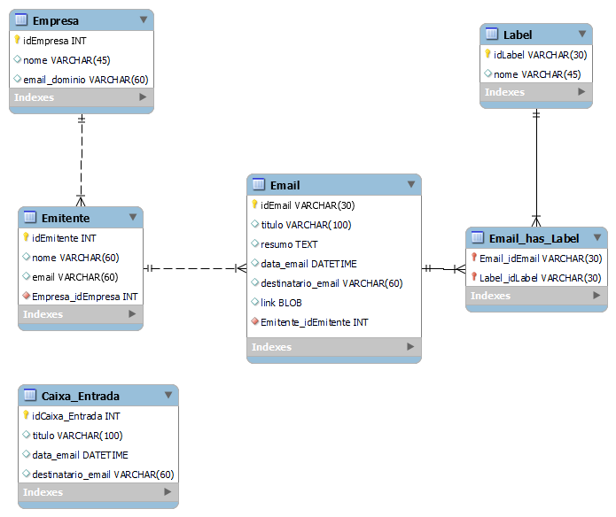

# Consulta Gmail API

Este projeto obtem informações relativas ao Gmail de determinado conta, através da API do Gmail usando o Python. Ele permite que você obtenha informações sobre os e-mails cadastrados, bem como as informações presentes na caixa de entrada. Além disso, você pode usar para obter informações sobre os usuários que mais encaminham e-mails.

## Pré-requisitos
Antes de começar, você precisará dos seguintes itens:

- Python 3.10.7 ou superior
- A ferramenta de gerenciamento de pacotes pip
- Uma conta do Google com o Gmail ativado
  
## Instalação

### Dependências do Projeto
- Para instalar as dependências do projeto, execute o seguinte comando:

> pip install --upgrade google-api-python-client google-auth-httplib2 google-auth-oauthlib

- Na pasta raiz do mesmo, é necessário adicionar o arquivo client_secret.json.
- Será necessário criar um banco de dados, no qual a estrutura está disponível no seguinte arquivo: [script-bd](https://github.com/SiqueiraGabriel/Consulta-Gmail-API/blob/main/Script-create-bd.sql) 

### Autorização
Para autorizar o acesso à API do Gmail, você precisará criar um arquivo client_secret.json. Você pode seguir [este tutorial](https://developers.google.com/gmail/api/quickstart/python?hl=pt-br) para criar o arquivo.

## Modelo Relacional
O modelo relacional foi usado para projetar a estrutura do banco de dados. Ele ajuda a entender as relações entre diferentes tabelas e como os dados são armazenados e acessados.

## Executando o projeto

Para executar o projeto, basta criar um novo objeto da classe Email.

Este objeto será responsável pela obtenção dos novos emails (desconsidera os que já estão cadastrados no Banco de Dados) e atualiza a caixa de entrada com as informações presentes no momento da execução (para uma melhor análise, interessante sempre deixar organizado vossa caixa de entrada).

Espero que isso ajude! Se você tiver alguma dúvida, não hesite em perguntar.
